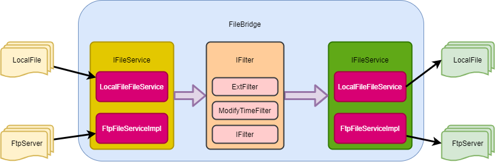

# FileBridge

文件同步传输桥程序
为了解决不同文件系统之间文件批量定制传输的场景实现的一个小工具。

基本设计图


## 核心接口

本项目有两个核心的接口，分别用于处理与文件服务对接及对文件进行过滤筛选判定

### IFileService

该接口是实现文件服务的核心接口，将对文件操作抽象实现，由框架层完成同步逻辑

### IFilter

该接口是实现对文件进行过滤的接口，该接口对`FileMeta`进行判断，返回判断结果是否进行同步

## ROADMAP

* [ ] 强化任务中的日志记录模式
* [ ] 增加更多的filter
  * [x] 文件名格式过滤
  * [x] 文件大小的过滤
  * [ ] ...
* [ ] 增加更多的plugin
  * [ ] oss
  * [ ] hdfs
  * [ ] ...
* [ ] 运行方式的优化
  * [ ] JOB运行的调度逻辑优化
  * [ ] 并行传输
  * [ ] 分布式传输
  * [ ] 增加更加多入单出，单入多出的运行模式（需要进一步讨论事务性）
  * [ ] 增强IFilter的业务性，使其能对文件内容也进行过滤
  * [ ] 对输入输出的接口进行拆分，构建出只读、只写的接口，对特定的文件系统降低负责度

## 同步命令

```
   java -Dfile.encoding=utf8 -jar FileBridge.jar /path/to/conf.json
```

## 配置文件说明

配置文件为数组，允许设置多个同步通道，同步时将会依次运行。 下面以单个文件通道为例说明：

```
  {
    // 源插件配置
    "input": {},
    // 目标插件配置
    "output": {},
    // 文件过滤器配置
    "file_filter":[],
    // 镜像模式参数 不设置则为移动模式
    "mirror_param":{
        //  1： 追加模式、2：全量模式
        "mirror_mode":1,
        // 镜像标记文件地址 不设置则为输出目录
        "clone_result_path":""
    }
  }
```

## 过滤器配置说明

### 修改时间过滤器

```
{
    // 固定值，插件类型
    "type": "modifyTime",
    // 扫描文件配置，只同步最后编辑时间n秒前的文件，设置为-1时为全部文件，默认值10
    "modifyWatcher": 10
}
```

### 前缀名过滤器

```
{
    // 固定值，插件类型
    "type": "prefix",
    // 后缀
    "prefix": "sync"
}
```

### 后缀名过滤器

```
{
    // 固定值，插件类型
    "type": "ext",
    // 后缀
    "ext": "zip"
}
```

### 文件大小过滤器

```
{
    // 固定值，插件类型
    "type": "fileSize",
    // 文件大小范围，不输入则为不约束，单位为byte
    "maxSize": "10000",
    "minSize": "10"
}
```

## 数据插件配置说明

### FTP插件

```
{
    // 固定值，插件类型
    "type": "ftp",
    // FTP服务器同步的根目录
    "root": "/file-ship-test",
    // FTP服务器的IP
    "ip": "192.168.7.131",
    // FTP服务器的端口
    "port": 9096,
    // FTP服务器的用户名
    "username": "root",
    // FTP服务器的密码
    "password": "123456"
}
```

### 本地文件插件

```
{
    // 固定值，插件类型
    "type": "local",
    // 本地同步根路径
    "root": "D:/local-shipping/src"
}
```

### minio插件

```
{
    // 固定值，插件类型
      "type": "minio",
    // 上传的桶
      "bucket": "fstest",
    // minio服务器url
      "url": "http://192.168.7.131:55004",
    // accessKey
      "accessKey": "q8D94qSdjBMi5x64",
    // secretKey
      "secretKey": "H4KVmGl9rybZEtPttuVxys02CAO8PTes",
    // 是否打印minio的trace日志
      "trace": true
    }
```
